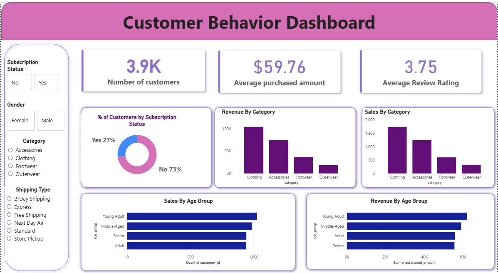

# Customer Shopping Behavior Analysis

## Overview
This project explores customer shopping behavior using transactional data 
from 3,900 purchases. I analyzed spending patterns, product preferences, 
customer segments, and subscription behavior to derive business insights.

## Dashboard

## Tools & Technologies
- Python (Pandas, Jupyter Notebook) - Data cleaning and EDA
- PostgreSQL (pgAdmin) - Business queries and analysis
- Power BI - Dashboard and visualization

## Project Files
| File | Description |
|------|-------------|
| `DA project_1.ipynb` | Python analysis and data preprocessing |
| `project.sql` | SQL queries for business analysis |
| `DA project - 1.pbix` | Power BI interactive dashboard |
| `customer_shopping_behavior.csv` | Raw dataset used for analysis |
| `Customer Shopping Behavior Analysis.pdf` | Project documentation |
| `Customer-Shopping-Behavior-Analysis.pdf` | Project presentation slides |

## Key Findings
- Male customers contributed significantly more revenue (68% vs 32%)
- 79% of customers fall under the Loyal segment
- Young Adults (18-25) had the highest revenue at $62,143
- Hats and Sneakers showed highest discount dependency (~50%)
- Express shipping users spend slightly more than standard shipping users

## Business Recommendations
- Boost subscription numbers by offering exclusive member benefits
- Reward repeat buyers to strengthen the Loyal customer base
- Re-evaluate discount strategy to protect profit margins
- Focus marketing campaigns on the 18-35 age group
